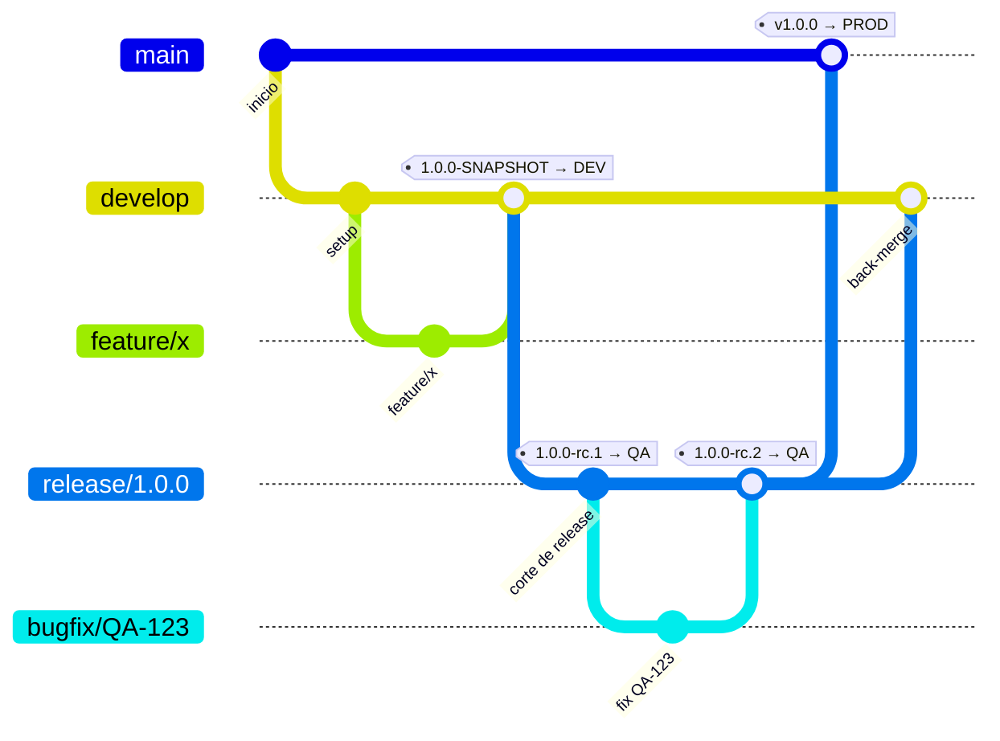

# Estrategia de Ramas y Flujo CI/CD

## 1. Ramas

| Rama            | Propósito                                                           | Ambiente        |
|-----------------|---------------------------------------------------------------------|-----------------|
| `main`          | Refleja producción. Solo recibe merges de releases ya certificadas. | Producción      |
| `develop`       | Integración continua. Recibe merges de `feature/*` vía PR.          | Desarrollo      |
| `release/x.y.z` | Punto de corte para certificación. Se crea desde `develop`.         | QA              |
| `hotfix/x.y.z`  | Corrección urgente sobre producción. Sale de `main`.                | QA → Producción |

Ramas de trabajo de corta duración:

- `feature/*` → sale de `develop`, vuelve a `develop` vía PR.
- `bugfix/*` → sale de `release/x.y.z` cuando QA reporta un bug, vuelve a esa misma `release/x.y.z` vía PR.
- `hotfix/*` → sale de `main`.

**Reglas:** nunca push directo a `main`, `develop` o `release/*` — todo entra vía PR con ≥1 aprobación y CI en verde.
Mientras una `release/x.y.z` está en certificación, no se agregan features nuevas a esa rama, solo fixes.

## 2. Ciclo de vida completo de una release

Recorrido punta a punta de una release, usando `1.0.0` como ejemplo (la primera release del proyecto). Cada subsección
indica el comando `git`, el workflow que se dispara y qué esperar de vuelta.



### 2.1 Desarrollo de un feature

```bash
git switch -c feature/mi-feature develop
# ... commits ...
git push -u origin feature/mi-feature
```

El push dispara `ci.yml` (build + tests). Abrir el PR hacia `develop` no dispara ningún workflow — la creación de PRs
no ejecuta CI. Se necesita ≥1 aprobación y el CI en verde del último push a la rama para mergear (regla de rama
protegida, revisada manualmente). Al mergear, el push resultante a `develop` dispara `cd-dev.yml`, que despliega el
`SNAPSHOT` del `pom.xml` a Desarrollo.

### 2.2 Corte de release

Cuando `develop` tiene el alcance listo para certificar:

```bash
git switch -c release/1.0.0 develop
git push -u origin release/1.0.0
```

El push dispara `cd-qa.yml`, que calcula la versión `1.0.0-rc.1` (`x.y.z` tomado del nombre de la rama, `rc.N` =
`github.run_number`) y despliega a QA. A partir de este punto, `release/1.0.0` solo recibe fixes vía `bugfix/*` — no se
agregan features nuevas.

### 2.3 Certificación en QA

QA confirma qué build está probando con `GET /api/version` (ver detalle del endpoint en la sección 3):

```bash
curl https://<host-qa>/api/version
```

### 2.4 Si QA reporta un bug

1. `bugfix/QA-123-descripcion` desde `release/1.0.0`:
   ```bash
   git switch -c bugfix/QA-123-descripcion release/1.0.0
   ```
2. PR hacia `release/1.0.0` (no hacia `develop` todavía). El PR en sí no dispara ningún workflow — `ci.yml` ya corrió
   con el push a `bugfix/QA-123-descripcion`.
3. Al mergear, el push a `release/1.0.0` hace que `cd-qa.yml` redespliegue automáticamente a QA con `1.0.0-rc.2`.
4. QA repite la certificación (regresión sobre lo que falló).
5. Se repite tantas veces como haga falta (`rc.3`, `rc.4`, ...) hasta certificar.

### 2.5 Cierre de release (certificación OK)

1. PR `release/1.0.0` → `main`. Aprobar y mergear (regla de rama protegida, ≥1 aprobación + CI en verde).
2. Taguear el commit resultante en `main`:
   ```bash
   git switch main
   git pull
   git tag v1.0.0
   git push origin v1.0.0
   ```
3. El push del tag dispara `cd-prod.yml`: verifica que el commit del tag sea ancestro de `origin/main` (
   `git merge-base --is-ancestor`) y calcula la versión `1.0.0` a partir del tag.
4. El job de despliegue queda **en espera de aprobación manual** — el Environment `production` tiene *required
   reviewers* configurados.
5. Tras aprobar: build, deploy, health check (`GET /api/actuator/health` y `GET /api/version`) y publicación de la
   GitHub Release con el JAR adjunto (`create_release: true`).
6. El pipeline queda pausado de nuevo en el job `verify-production` — Environment `production-verification`, también
   con *required reviewers* — para que alguien pruebe manualmente lo desplegado:
    - Si **aprueba**: el issue padre pasa a `Deployed to Production`.
    - Si **rechaza** (o la aprobación vence sin respuesta): corre `rollback-production`, que revierte el servicio al
      JAR anterior (`JAR_BACKUP_PATH`). El issue padre se queda en `Verifying in Production`.
7. Al cerrarse (mergearse) el PR `release/1.0.0` → `main`, `release-backmerge.yml` abre automáticamente un PR
   `release/1.0.0` → `develop` para no perder los fixes acumulados durante la certificación (si ya existe uno abierto,
   no crea un duplicado). Alguien del equipo debe revisarlo y mergearlo manualmente.

### 2.6 Flujo de hotfix

Corrección urgente sobre producción. La diferencia clave frente al flujo normal: **sale de `main`, no de `develop`**.

```bash
git switch -c hotfix/1.0.1 main
git push -u origin hotfix/1.0.1
```

1. El push dispara `cd-qa.yml` (también matchea `hotfix/**`), que calcula `1.0.1-rc.1` y despliega a QA.
2. Certificación en QA, igual que en 2.3/2.4 (bugs adicionales vía PR hacia la misma `hotfix/1.0.1`).
3. PR `hotfix/1.0.1` → `main`, aprobar y mergear.
4. `git tag v1.0.1 && git push origin v1.0.1` → dispara `cd-prod.yml` (misma aprobación manual del Environment
   `production`).
5. `release-backmerge.yml` abre el PR automático `hotfix/1.0.1` → `develop` (matchea `hotfix/*` igual que `release/*`).

## 3. Versionado

La versión semántica (`1.0.0`) se mantiene fija durante todo el ciclo de certificación. Cada intento de certificación
genera un build identificable:

| Momento                              | Versión                             |
|--------------------------------------|-------------------------------------|
| Push a `develop`                     | `1.0.0-SNAPSHOT` (la del `pom.xml`) |
| Primer deploy a QA (`release/1.0.0`) | `1.0.0-rc.1`                        |
| Fix del bug 1                        | `1.0.0-rc.2`                        |
| Tag `v1.0.0` → Producción            | `1.0.0`                             |

El `x.y.z` de cada `rc.N` se toma del **nombre de la rama** (`release/1.0.0`, `hotfix/1.0.1`); el número de build (
`rc.N`) es `github.run_number`. Ver `.github/workflows/cd-qa.yml`.

QA confirma exactamente qué build está probando con:

```bash
curl https://<host-qa>/api/version
```

que devuelve `version`, `commit`, `branch` y `buildTime` (`co.edu.docurural.health.controller.VersionController`,
poblado por el goal `build-info` de `spring-boot-maven-plugin` en `pom.xml`).

### Coordinación con el repo del front (Angular)

Front y back son repos independientes. Usar el mismo número base `x.y.z-rc.N` en ambos y documentar en el ticket de
release qué combinación de versiones fue certificada junta.

## 4. Pipelines (`.github/workflows/`)

| Workflow                | Disparador                                                                                      | Qué hace                                                                                                                                                                                                                                                                 |
|-------------------------|-------------------------------------------------------------------------------------------------|--------------------------------------------------------------------------------------------------------------------------------------------------------------------------------------------------------------------------------------------------------------------------|
| `ci.yml`                | Push a `feature/*`, `bugfix/*`, `hotfix/*` (no se dispara al crear/actualizar un PR)             | `mvn verify` (tests + gate JaCoCo 80%/65%)                                                                                                                                                                                                                               |
| `cd-dev.yml`            | Push a `develop`, o manual (`workflow_dispatch`)                                                | Despliega a Desarrollo con la versión `SNAPSHOT` del pom (o el input `version` en manual)                                                                                                                                                                                |
| `cd-qa.yml`             | Push a `release/**` o `hotfix/**`, o manual (`workflow_dispatch`)                                | Calcula `x.y.z-rc.N` desde el nombre de rama y despliega a QA (o usa el input `version` en manual)                                                                                                                                                                       |
| `cd-prod.yml`           | Push de un tag `v*.*.*`, o manual (`workflow_dispatch`) sobre un tag existente                    | Verifica que el tag esté en `main`, despliega a Producción (requiere aprobación del Environment `production`), publica GitHub Release, y pausa en el Environment `production-verification` para confirmar o revertir — ver [2.5](#25-cierre-de-release-certificación-ok) |
| `release-backmerge.yml` | Se cierra (merge) un PR de `release/*`/`hotfix/*` hacia `main`                                  | Abre PR automático de esa rama hacia `develop` — ver [2.5](#25-cierre-de-release-certificación-ok)                                                                                                                                                                       |
| `_deploy.yml`           | Reutilizable (`workflow_call`)                                                                  | Lógica común de build + deploy + health check + rollback que usan los tres `cd-*.yml`. Concurrency por ambiente: los despliegues al mismo ambiente se encolan, nunca se solapan.                                                                                        |

Cada despliegue verifica `GET /api/actuator/health` (reintentos con backoff) y `GET /api/version` (que la versión
reportada coincida con la esperada) antes de darse por exitoso. Si falla, revierte automáticamente al JAR anterior (
`_deploy.yml`, paso "Rollback automático").

### 4.1 Despliegue manual (`workflow_dispatch`)

Cada `cd-*.yml` también se puede disparar a mano desde la pestaña **Actions** (botón "Run workflow") o con
`gh workflow run`. Sirve para reponer el componente en un ambiente cuya infraestructura fue recreada con
Terraform/AWS — sin inventar un commit, sin quemar un `rc.N` de QA y sin mover el tag de producción.

```bash
gh workflow run "CD — Despliegue a Desarrollo" --ref develop
gh workflow run "CD — Despliegue a QA" --ref release/1.0.0 -f version=1.0.0-rc.3
gh workflow run "CD — Despliegue a Producción" --ref v1.0.0
```

Diferencias frente al disparo automático:

- **El tablero de GitHub Projects nunca se toca.** Un despliegue manual repone el componente, no representa
  avance de la release — los pasos de `update_project_status.py` quedan `skipped`.
- **`publish_package` y `create_release` van en `false` por defecto** (inputs opcionales para forzarlos). Publicar
  o crear una release que ya existe responde `409 Conflict` y rompe el job — casi seguro al redesplegar una
  versión que ya pasó por el pipeline automático.
- **Dev**: input `version` opcional; vacío = la del `pom.xml` del ref elegido. Sin guarda de rama — se puede elegir
  cualquier ref, útil para probar una `feature/*` sin mergear a `develop`.
- **QA**: input `version` opcional; vacío = `x.y.z-rc.<run_number>` como siempre. Si se indica, debe seguir el
  patrón `x.y.z` o `x.y.z-rc.N` **y coincidir con el `x.y.z` de la rama** (`release/1.0.0` no acepta
  `version=1.1.0-rc.1`).
- **Producción**: sin input de versión — el tag elegido en "Use workflow from" ya la fija. Se mantiene la
  aprobación del Environment `production`, pero se omite `verify-production` (la verificación manual
  post-despliegue) para no dejar la reposición pausada esperando una segunda aprobación; por eso
  `rollback-production` tampoco se dispara en este modo (solo reacciona a que `verify-production` sea rechazada o
  venza, y aquí queda `skipped`). El rollback automático por health check de `_deploy.yml` sigue activo igual que
  en el flujo automático.

**Requisito:** GitHub solo ofrece "Run workflow" para un workflow cuya definición con `workflow_dispatch` ya está
en la rama por defecto del repo (`main`). Hasta que estos cambios no lleguen a `main` por el flujo normal, el botón
no aparece.

**Nota para el primer despliegue sobre infra recién creada:** no hay JAR previo, así que `_deploy.yml` no deja
respaldo (`JAR_BACKUP_PATH`) — si el health check falla, no hay rollback automático posible.

## 5. Protecciones de rama recomendadas (configurar en GitHub)

- `main`, `develop`, `release/*`: sin push directo, solo PR, ≥1 aprobación. `ci.yml` no corre sobre el PR (solo sobre
  el push a la rama de origen), así que **no** debe configurarse `build-and-test` como status check requerido — de
  hacerlo, el check nunca se reporta y el PR queda bloqueado indefinidamente.
- `main`: adicionalmente restringir quién puede pushear directamente y prohibir force-push.
- Environment `production`: required reviewers, y restringido a que solo tags `v*` puedan desplegar.
- Environment `production-verification`: required reviewers (puede ser el mismo grupo que `production`) — sin esto el
  job de verificación se auto-aprueba y el gate no sirve de nada.
- Secret de repo `PROJECTS_TOKEN`: PAT (classic) con scopes `repo` y `project`, usado por
  `.github/scripts/update_project_status.py` para mover el issue padre en el tablero — ver
  [sección 6](#6-sincronización-con-el-tablero-de-github-projects).
- Webhook de organización (`projects_v2_item`) apuntando al AWS Lambda de `github-webhook-relay`, y
  ese Lambda desplegado con `GITHUB_WEBHOOK_SECRET`, `GITHUB_DISPATCH_TOKEN` y `TARGET_REPO` configurados —
  necesarios para la cascada a sub-issues cuando el padre se mueve a mano, ver [6.1](#61-cascada-del-padre-a-sus-sub-issues).
- **Settings → Actions → General → Workflow permissions → "Allow GitHub Actions to create and approve pull requests"**:
  debe estar habilitado. Sin esto, `release-backmerge.yml` falla con
  `GraphQL: GitHub Actions is not permitted to create or approve pull requests`, aunque el workflow ya declare
  `permissions: pull-requests: write`. Si el repo pertenece a una organización, puede que también haya que habilitarlo a
  nivel de organización.

## 6. Sincronización con el tablero de GitHub Projects

`release-configuration.json` (raíz del repo) declara la release en curso:

```json
{
  "version": "1.0.0",
  "project": {
    "owner": "CCPL-Solutions",
    "number": 12
  },
  "releaseIssueUrl": "https://github.com/CCPL-Solutions/docurural-backend/issues/41"
}
```

`releaseIssueUrl` apunta al issue padre de la release en el tablero (los hijos son las HU técnicas que
entran con esa versión, y pueden vivir en cualquier repo de la organización). Se edita a mano al cortar cada
release (ver [2.2](#22-corte-de-release)).

En los puntos deterministas del pipeline, `.github/scripts/update_project_status.py` mueve el campo `Status`
del issue padre:

| # | Momento del pipeline                         | Desde                                     | Hasta                                     |
|---|----------------------------------------------|-------------------------------------------|-------------------------------------------|
| 1 | Termina el despliegue a Desarrollo           | `Development Completed`                   | `Ready for installation in certification` |
| 2 | Arranca el despliegue a QA                   | `Ready for installation in certification` | `Deploying to Certification`              |
| 3 | Termina el despliegue a QA                   | `Deploying to Certification`              | `Deployed to Certification`               |
| 4 | Arranca el despliegue a Prod (gate aprobado) | `Ready for Production Deployment`         | `Deploying to Production`                 |
| 5 | Termina el despliegue a Prod                 | `Deploying to Production`                 | `Verifying in Production`                 |
| 6 | Se aprueba la verificación manual en Prod    | `Verifying in Production`                 | `Deployed to Production`                  |

El resto de transiciones del tablero (refinamiento, certificación QA, validación previa a producción) son
manuales por diseño — las hace la persona correspondiente en el momento correspondiente.

Antes de escribir un estado nuevo, el script valida dos guardas y si alguna falla hace un no-op (nunca un
error que tumbe el despliegue):

1. La `version` de `release-configuration.json` coincide con la versión que se está desplegando (normalizando
   sufijos: `1.0.0-SNAPSHOT` y `1.0.0-rc.3` se comparan como `1.0.0`).
2. El estado actual del issue en el tablero coincide con el "Desde" esperado — esto hace la automatización
   **idempotente**: un redespliegue a QA (`rc.2`, `rc.3`, ...) cuando QA ya movió la tarjeta a `In Certification`
   no la arrastra hacia atrás.

Cualquier otro fallo (token vencido, issue fuera del proyecto, error de red, nombre de estado que no existe en
el campo `Status`) queda registrado como `::warning::` en el log del job, pero nunca falla el despliegue — mismo
criterio que ya rige `ActivityLogService` en el backend: un fallo de auditoría/trazabilidad no revierte la
operación de negocio.

### 6.1 Cascada del padre a sus sub-issues

Los hijos (sub-issues nativas de GitHub) del issue padre siguen automáticamente su estado, sin importar si
el padre lo mueve el pipeline o una persona a mano:

- **Caso automático**: cada vez que `update_project_status.py` mueve al padre (tabla de arriba), al final
  también propaga ese mismo estado a todos sus sub-issues que estén en el mismo Project. Sin infraestructura
  adicional — ocurre en la misma ejecución del workflow.
- **Caso manual**: GitHub Actions no tiene un disparador nativo para cambios de campo en Projects v2 (son a
  nivel de organización, no de repo). El flujo es:

  ```
  Alguien arrastra la tarjeta del padre
    → webhook de organización  projects_v2_item / edited
    → AWS Lambda (infra/github-webhook-relay) — verifica firma HMAC, filtra ruido
    → repository_dispatch en CCPL-Solutions/project-automation
    → project-cascade.yml (checkout cruzado de release-configuration.json)
    → update_project_status.py MODE=cascade
    → los sub-issues quedan en el mismo estado que el padre
  ```

  El Lambda es un relay "tonto": no sabe qué issue es el padre de ninguna release, solo reenvía el
  `content_node_id` del issue editado. La guarda real está en `update_project_status.py`: si el `content_node_id`
  recibido no coincide con el issue de `releaseIssueUrl`, no hace nada — así, mover cualquier otra tarjeta del
  tablero no dispara una cascada indebida.

  Este workflow vive en el repo aparte `project-automation` (no en `docurural-backend`) a propósito: el evento
  que lo dispara no tiene relación con el pipeline de este repo, y mezclarlo ensuciaría su pestaña de Actions
  con corridas ajenas a CI/CD. El script en `project-automation` hace un checkout cruzado de este repo (con un
  token de solo lectura, guardado como secret `RELEASE_CONFIG_READ_TOKEN`) para leer `release-configuration.json`.
  Por eso `update_project_status.py` en `docurural-backend` solo conserva el modo de despliegue —la cascada manual
  vive en la copia de ese script dentro de `project-automation`.

  Detalles de despliegue del Lambda en `infra/github-webhook-relay/README.md` — ese directorio vive en el
  repositorio de infraestructura, no en `docurural-backend`.

  > Los workflows de `repository_dispatch` solo corren desde la rama por defecto del repo que los recibe —
  > `project-cascade.yml` no reacciona a nada hasta que esté mergeado en `main` de `project-automation`.

En ambos casos, un hijo que no esté en el mismo Project que el padre se reporta como `::warning::` y se omite,
sin interrumpir a los demás.
