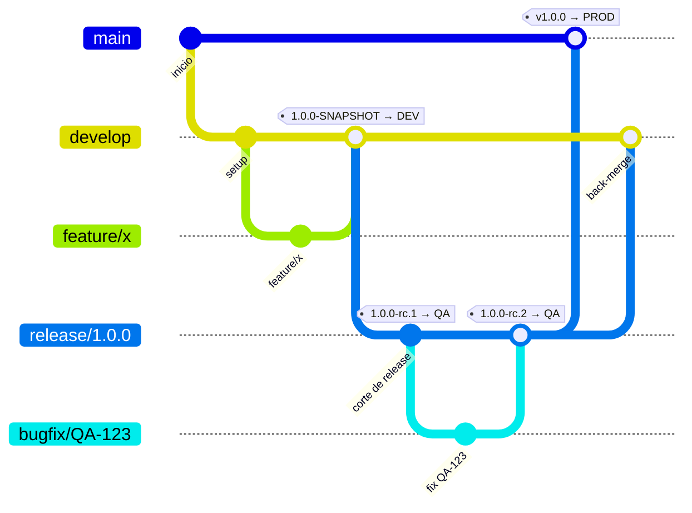

# Estrategia de Ramas y Flujo CI/CD

## 1. Ramas

| Rama | Propósito | Ambiente |
|---|---|---|
| `main` | Refleja producción. Solo recibe merges de releases ya certificadas. | Producción |
| `develop` | Integración continua. Recibe merges de `feature/*` vía PR. | Desarrollo |
| `release/x.y.z` | Punto de corte para certificación. Se crea desde `develop`. | QA |
| `hotfix/x.y.z` | Corrección urgente sobre producción. Sale de `main`. | QA → Producción |

Ramas de trabajo de corta duración:

- `feature/*` → sale de `develop`, vuelve a `develop` vía PR.
- `bugfix/*` → sale de `release/x.y.z` cuando QA reporta un bug, vuelve a esa misma `release/x.y.z` vía PR.
- `hotfix/*` → sale de `main`.

**Reglas:** nunca push directo a `main`, `develop` o `release/*` — todo entra vía PR con ≥1 aprobación y CI en verde. Mientras una `release/x.y.z` está en certificación, no se agregan features nuevas a esa rama, solo fixes.

## 2. Ciclo de vida completo de una release

Recorrido punta a punta de una release, usando `1.0.0` como ejemplo (la primera release del proyecto). Cada subsección indica el comando `git`, el workflow que se dispara y qué esperar de vuelta.



### 2.1 Desarrollo de un feature

```bash
git switch -c feature/mi-feature develop
# ... commits ...
git push -u origin feature/mi-feature
```

El push dispara `ci.yml` (build + tests). Al abrir el PR hacia `develop`, `ci.yml` vuelve a correr como *status check* del PR — se necesita ≥1 aprobación y CI en verde para mergear (regla de rama protegida). Al mergear, el push resultante a `develop` dispara `cd-dev.yml`, que despliega el `SNAPSHOT` del `pom.xml` a Desarrollo.

### 2.2 Corte de release

Cuando `develop` tiene el alcance listo para certificar:

```bash
git switch -c release/1.0.0 develop
git push -u origin release/1.0.0
```

El push dispara `cd-qa.yml`, que calcula la versión `1.0.0-rc.1` (`x.y.z` tomado del nombre de la rama, `rc.N` = `github.run_number`) y despliega a QA. A partir de este punto, `release/1.0.0` solo recibe fixes vía `bugfix/*` — no se agregan features nuevas.

En el mismo commit de corte, actualizar [`CHANGELOG.md`](../CHANGELOG.md): renombrar `## [Sin publicar]` a `## [1.0.0] - AAAA-MM-DD (programada)` con la fecha objetivo de paso a producción, redactar la descripción general de la versión, y abrir una nueva sección `## [Sin publicar]` vacía encima para lo que se integre después del corte.

### 2.3 Certificación en QA

QA confirma qué build está probando con `GET /api/version` (ver detalle del endpoint en la sección 3):

```bash
curl https://<host-qa>/api/version
```

### 2.4 Si QA reporta un bug

1. `bugfix/QA-123-descripcion` desde `release/1.0.0`:
   ```bash
   git switch -c bugfix/QA-123-descripcion release/1.0.0
   ```
2. PR hacia `release/1.0.0` (no hacia `develop` todavía). Corre `ci.yml`.
3. Al mergear, el push a `release/1.0.0` hace que `cd-qa.yml` redespliegue automáticamente a QA con `1.0.0-rc.2`.
4. QA repite la certificación (regresión sobre lo que falló).
5. Se repite tantas veces como haga falta (`rc.3`, `rc.4`, ...) hasta certificar.

### 2.5 Cierre de release (certificación OK)

1. PR `release/1.0.0` → `main`. Aprobar y mergear (regla de rama protegida, ≥1 aprobación + CI en verde).
2. Taguear el commit resultante en `main`:
   ```bash
   git switch main
   git pull
   git tag v1.0.0
   git push origin v1.0.0
   ```
3. El push del tag dispara `cd-prod.yml`: verifica que el commit del tag sea ancestro de `origin/main` (`git merge-base --is-ancestor`) y calcula la versión `1.0.0` a partir del tag.
4. El job de despliegue queda **en espera de aprobación manual** — el Environment `production` tiene *required reviewers* configurados.
5. Tras aprobar: build, deploy, health check (`GET /api/actuator/health` y `GET /api/version`) y publicación de la GitHub Release con el JAR adjunto (`create_release: true`).
6. Al cerrarse (mergearse) el PR `release/1.0.0` → `main`, `release-backmerge.yml` abre automáticamente un PR `release/1.0.0` → `develop` para no perder los fixes acumulados durante la certificación (si ya existe uno abierto, no crea un duplicado). Alguien del equipo debe revisarlo y mergearlo manualmente.
7. Junto con el tag, retirar la marca `(programada)` de la entrada correspondiente en [`CHANGELOG.md`](../CHANGELOG.md) y ajustar la fecha si el despliegue real ocurrió en un día distinto al planeado.

### 2.6 Flujo de hotfix

Corrección urgente sobre producción. La diferencia clave frente al flujo normal: **sale de `main`, no de `develop`**.

```bash
git switch -c hotfix/1.0.1 main
git push -u origin hotfix/1.0.1
```

1. El push dispara `cd-qa.yml` (también matchea `hotfix/**`), que calcula `1.0.1-rc.1` y despliega a QA.
2. Certificación en QA, igual que en 2.3/2.4 (bugs adicionales vía PR hacia la misma `hotfix/1.0.1`).
3. PR `hotfix/1.0.1` → `main`, aprobar y mergear.
4. `git tag v1.0.1 && git push origin v1.0.1` → dispara `cd-prod.yml` (misma aprobación manual del Environment `production`).
5. `release-backmerge.yml` abre el PR automático `hotfix/1.0.1` → `develop` (matchea `hotfix/*` igual que `release/*`).

## 3. Versionado

La versión semántica (`1.0.0`) se mantiene fija durante todo el ciclo de certificación. Cada intento de certificación genera un build identificable:

| Momento | Versión |
|---|---|
| Push a `develop` | `1.0.0-SNAPSHOT` (la del `pom.xml`) |
| Primer deploy a QA (`release/1.0.0`) | `1.0.0-rc.1` |
| Fix del bug 1 | `1.0.0-rc.2` |
| Tag `v1.0.0` → Producción | `1.0.0` |

El `x.y.z` de cada `rc.N` se toma del **nombre de la rama** (`release/1.0.0`, `hotfix/1.0.1`); el número de build (`rc.N`) es `github.run_number`. Ver `.github/workflows/cd-qa.yml`.

QA confirma exactamente qué build está probando con:

```bash
curl https://<host-qa>/api/version
```

que devuelve `version`, `commit`, `branch` y `buildTime` (`co.edu.docurural.health.controller.VersionController`, poblado por el goal `build-info` de `spring-boot-maven-plugin` en `pom.xml`).

### Coordinación con el repo del front (Angular)

Front y back son repos independientes. Usar el mismo número base `x.y.z-rc.N` en ambos y documentar en el ticket de release qué combinación de versiones fue certificada junta.

## 4. Pipelines (`.github/workflows/`)

| Workflow | Disparador | Qué hace |
|---|---|---|
| `ci.yml` | Push a `feature/*`, `bugfix/*`, `hotfix/*`; PR hacia `develop`, `main`, `release/*`, `hotfix/*` | `mvn verify` (tests + gate JaCoCo 80%/65%) |
| `cd-dev.yml` | Push a `develop` | Despliega a Desarrollo con la versión `SNAPSHOT` del pom |
| `cd-qa.yml` | Push a `release/**` o `hotfix/**` | Calcula `x.y.z-rc.N` desde el nombre de rama y despliega a QA |
| `cd-prod.yml` | Push de un tag `v*.*.*` | Verifica que el tag esté en `main`, despliega a Producción (requiere aprobación del Environment `production`), publica GitHub Release — ver [2.5](#25-cierre-de-release-certificación-ok) |
| `release-backmerge.yml` | Se cierra (merge) un PR de `release/*`/`hotfix/*` hacia `main` | Abre PR automático de esa rama hacia `develop` — ver [2.5](#25-cierre-de-release-certificación-ok) |
| `_deploy.yml` | Reutilizable (`workflow_call`) | Lógica común de build + deploy + health check + rollback que usan los tres `cd-*.yml` |

Cada despliegue verifica `GET /api/actuator/health` (reintentos con backoff) y `GET /api/version` (que la versión reportada coincida con la esperada) antes de darse por exitoso. Si falla, revierte automáticamente al JAR anterior (`_deploy.yml`, paso "Rollback automático").

## 5. Protecciones de rama recomendadas (configurar en GitHub)

- `main`, `develop`, `release/*`: sin push directo, solo PR, ≥1 aprobación, status check `build-and-test` en verde.
- `main`: adicionalmente restringir quién puede pushear directamente y prohibir force-push.
- Environment `production`: required reviewers, y restringido a que solo tags `v*` puedan desplegar.
- **Settings → Actions → General → Workflow permissions → "Allow GitHub Actions to create and approve pull requests"**: debe estar habilitado. Sin esto, `release-backmerge.yml` falla con `GraphQL: GitHub Actions is not permitted to create or approve pull requests`, aunque el workflow ya declare `permissions: pull-requests: write`. Si el repo pertenece a una organización, puede que también haya que habilitarlo a nivel de organización.
